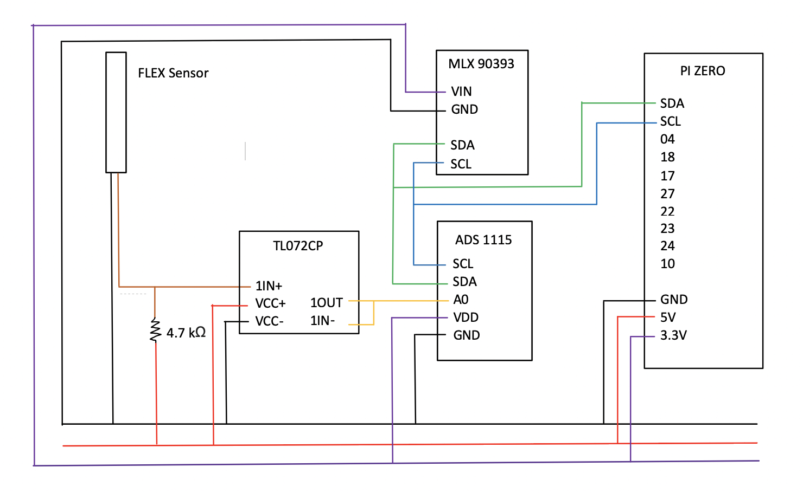

# Bamboo

## Quick Links

1. Github repo for the Bamboo cross-platform app: https://github.com/zenasgram/Bamboo
2. Official Website: https://koi-sprout-xmz8.squarespace.com/

## Introduction

Simply download the app and place the adhesive posture sensor on your back. Using our app, you’ll be able to visualise how your posture has progressed throughout the day. You’ll also receive Panda Pokes, which notify you when you’ve been slouching for an extended period of time. 

You can quickly gauge which of your activities are most harmful for your posture by tracking whether you are at home, playing a musical instrument, doing some sport or sleeping. These modes adjust the notification sensitivities so that you don’t get a Panda Poke when you’re fast asleep.

By setting activity selection to Auto, the app will automatically set mode for you, in our current prototype our compass sensor switches between home and sleep mode on its own.

## Technical Details:

### Hardware 

In Bamboo, the main sensor is a Flex sensor where its resistance increases as the sensor's curvature increases. This enable us to measure the curvature of user's neck/upper back and inform the user if the user is slouching too much. Since the flex sensor is analog, an additional op-amp (TL072CP) and an ADC (ADS1115) are used alongside the flex sensor to enable complete i2c communication with Pi Zero. 

Besides the main sensor, a additional 3D magnetometer (MLX 90393) is used to tell if the user is currently lying down or standing/sitting upright. This provides further information to the application, enabling feature such as auto-switching between modes. 

These two slave sensor are then connected to the master Pi Zero via i2c communication. Pi Zero will handle the next step of preprocessing of raw sensor data and communication with application via Mqtt broker. 

### Connection (Mqtt broker)
... TODO: chris

### Application
... TODO: zenas

## Credits:

Zenas (https://github.com/zenasgram), Chris (https://github.com/ChrisDeverall), CK (https://github.com/chikeen) at Imperial College London 2020
